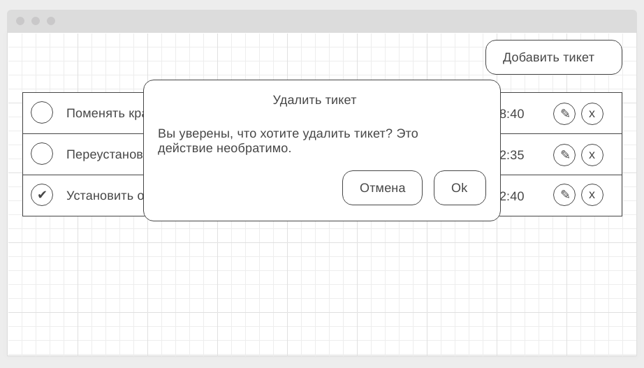

Правила сдачи задания:

1. **Важно**: в рамках этого ДЗ нужно использовать npm (а значит, никакого `yarn.lock` в репозитории быть не должно)
1. Frontend должен собираться через Webpack (включая картинки и стили) и выкладываться на Github Pages через Appveyor
1. В README.md должен быть размещён бейджик сборки и ссылка на Github Pages (Heroku для Backend'а)
1. В качестве результата присылайте проверяющему ссылки на ваши GitHub-проекты
1. Авто-тесты писать не требуется

**Важно**: в данном ДЗ вам потребуется выполнить мини-проект. Мы понимаем, что он может занять чуть больше времени, чем обычные ДЗ, но тема HTTP настолько важна, что стоит уделить этому чуть больше времени.

---

### HelpDesk

#### Легенда

Пока backend-разработчик находится в отпуске, вам поручили сделать прототип API для сервиса управления заявками на помощь (можете за себя порадоваться, так недалеко и до fullstack'а), к которому вам и нужно будет в дальнейшем прикруить frontend.

#### Описание

Для хранения данных мы будем оперировать следующими структурами:
```javascript
Ticket {
    id // идентификатор (уникальный в пределах системы)
    name // краткое описание
    status // boolean - сделано или нет
    created // дата создания (timestamp)
}

TicketFull {
    id // идентификатор (уникальный в пределах системы)
    name // краткое описание
    description // полное описание
    status // boolean - сделано или нет
    created // дата создания (timestamp)
}
```

Напишите сервер с использованием koa, который работает по следующей схеме:
* GET    ?method=allTickets           - список тикетов
* GET    ?method=ticketById&id=`<id>` - полное описание тикета (где `<id>` - идентификатор тикета)
* POST   ?method=createTicket         - создание тикета (`<id>` генерируется на сервере, в теле формы `name`, `description`, `status`)

Соответственно:
* GET    ?method=allTickets           - массив объектов типа `Ticket` (т.е. без `description`)
* GET    ?method=ticketById&id=`<id>` - объект типа `TicketFull` (т.е. с `description`)
* POST   ?method=createTicket         - в теле запроса форма с полями для объекта типа `Ticket` (с `id` = `null`)

Сервер необходимо развернуть на Heroku. Авто-тесты писать не нужно.

Не забывайте про CORS.

Для упрощения тестирования можете при старте сервера добавлять туда несколько тикетов.

Для того, чтобы с сервера отдавать данные, достаточно в обработчиках koa написать:
```js
const tickets = [];

app.use(async ctx => {
    const { method } = ctx.request.querystring;

    switch (method) {
        case 'allTickets':
            ctx.response.body = tickets;
            return;
        // TODO: обработка остальных методов
        default:
            ctx.response.status = 404;
            return;
    }
});
```

Для того, чтобы обработать полученный ответ во Frontend, достаточно вот этого кода:
```js
xhr.addEventListener('load', () => {
    if (xhr.status >= 200 && xhr.status < 300) {
        try {
            const data = JSON.parse(xhr.responseText);
        } catch (e) {
            console.error(e);
        }
    }
});
```

В качестве результата пришлите проверяющему ссылку на Heroku и на ваш GitHub репозиторий.

---

### HelpDesk: Frontend

#### Легенда

API вами написано, пора приступить к своим прямым обязанностям - написанию фронтенда, который будет с этим API работать.

#### Описание

Общий вид списка тикетов (должны загружаться с сервера в формате JSON):


Модальное окно добавления нового тикета (вызывается по кнопке "Добавить тикет" в правом верхнем углу):


Модальное окно редактирования существующего тикета (вызвается по кнопке с иконкой "✎" - карандашик):


Модальное окно подтверждения удаления (вызывается по кнопке с иконкой "x" - крестик):



Для просмотра деталей тикета нужно нажать на самом тикете (но не на контролах - сделано, редактировать или удалить):


В качестве бонуса можете отображать какую-нибудь иконку загрузки (см. https://loading.io) на время подгрузки.

Авто-тесты к данной задаче не требуются. Все данные и изменения должны браться/сохраняться на сервере, который вы написали в предыдущей задаче.

В качестве результата пришлите проверяющему ссылку на GitHub репозиторий.

P.S. Подгрузка подробного описания специально организована в виде отдельного запроса, мы прекрасно понимаем, что на малых объёмах информации нет смысла делать её отдельно.
